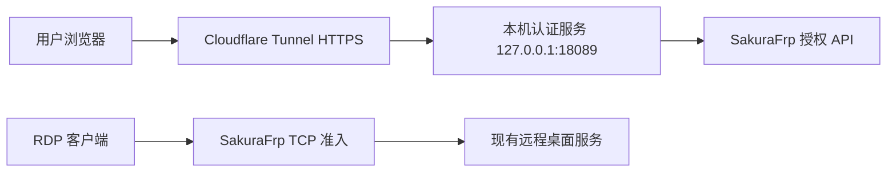

# RDP Access Auth

为通过 SakuraFrp 暴露的远程桌面增加 HTTPS 认证入口。访问者先在浏览器完成认证，再使用原生 RDP 客户端连接；没有通过认证的公网 IPv4 不会进入 SakuraFrp 的 RDP 准入规则。

当前推荐使用 RPM 或 DEB 安装包。安装包包含认证服务、浏览器管理页和运行依赖；首次部署由浏览器向导或终端向导完成，不需要创建 Python 虚拟环境，也不需要手动复制 systemd 文件。源码目录中的 `./rdp-auth` 仍适合开发、测试和前台运行。

## 架构与适用范围



认证服务只监听本机回环地址，Cloudflare Tunnel 是唯一的网页入口；原 RDP 域名保持“仅 DNS”，不要把原生 RDP 放到普通 Cloudflare 橙云代理后面。项目不会安装或代替远程桌面服务，也不会创建 SakuraFrp、Cloudflare 账户或 DNS 记录。

认证按公网 IPv4 放行。同一公网出口的设备会共享这次准入，RDP 客户端仍然必须通过操作系统账户登录。浏览器与 RDP 客户端应使用同一个公网 IPv4；SakuraFrp 的 `auth_time` 决定授权有效期，到期后拦截新连接，不保证断开已经建立的会话。

支持固定访问密码、临时访问密码和 WebAuthn 通行密钥。固定密码为 16～128 位并包含大小写字母、数字和特殊符号；临时密码由三个随机中文词组成，成功使用后立即轮换；通行密钥要求设备完成用户验证。同一 IP 连续失败 5 次会封禁 15 分钟，多个 IP 的失败会触发临时全站锁定。

## 部署前准备

- 带 systemd 的 Fedora、RHEL、Ubuntu 或其他 Linux；安装包必须匹配发行版、CPU 架构和 Python 次版本。
- 已正常工作的 RDP 服务和 SakuraFrp TCP 隧道。
- SakuraFrp API Token、隧道 ID，并能启用 `auth_mode = server` 和 `auth_time`。
- 托管在 Cloudflare 的认证子域名，例如 `auth.example.com`。
- 一个专用 Cloudflare Tunnel Token；Tunnel 只需要转发认证域名到本机认证端口。

不要把访问密码、SakuraFrp Token、Cloudflare Tunnel Token 或 Turnstile Secret 粘贴到聊天、截图或 Git 仓库。向导会隐藏终端输入，浏览器提交后会清空敏感字段。

## 六步完成部署

### 1. 安装匹配的软件包

请先打开官网的[发行版下载页](/projects/rdp-access-auth/downloads)选择文件；也可以直接查看 [GitHub Releases](https://github.com/zxaBinbina/rdp-access-auth/releases)。下载与主机匹配的 RPM 或 DEB，不要混用发行版、架构或 Python 次版本不匹配的文件。

```bash
set -euo pipefail
release_json=$(mktemp)
trap 'rm -f "$release_json"' EXIT
curl -fsSL -H 'Accept: application/vnd.github+json' \
  'https://api.github.com/repos/zxaBinbina/rdp-access-auth/releases?per_page=1' \
  -o "$release_json"

case "$(uname -m)" in
  x86_64) asset_arch='x86_64|amd64' ;;
  aarch64|arm64) asset_arch='aarch64|arm64' ;;
  *) asset_arch='' ;;
esac

if command -v dnf >/dev/null 2>&1; then
  asset_ext='.rpm'
  package_manager='dnf'
elif command -v apt >/dev/null 2>&1; then
  asset_ext='.deb'
  package_manager='apt'
else
  echo '未找到 dnf 或 apt，请从发行版下载页手动选择安装包。' >&2
  exit 1
fi

package_url=$(jq -r --arg ext "$asset_ext" --arg arch "$asset_arch" \
  '[.[0].assets[] | select(.name | endswith($ext)) | select($arch == "" or (.name | test($arch)))] | .[0].browser_download_url // empty' \
  "$release_json")
if [ -z "$package_url" ]; then
  echo '最新 Release 没有匹配当前系统架构的安装包，请打开官网发行版下载页手动选择。' >&2
  exit 1
fi

package_file=$(basename "$package_url")
curl -fLO "$package_url"
curl -fLO "$package_url.sha256"
sha256sum -c "$package_file.sha256"
sudo "$package_manager" install "./$package_file"

rdp-auth --help
```

如果没有匹配架构的文件，请打开[发行版下载页](/projects/rdp-access-auth/downloads)手动选择。不要把 Fedora RPM 安装到 Debian/Ubuntu，也不要把 amd64 DEB 安装到 ARM 主机。

### 2. 打开部署向导

```bash
rdp-auth deploy --gui  # 浏览器表单
rdp-auth deploy        # 终端交互
rdp-auth deploy --dry-run
```

向导只监听 `127.0.0.1`，终端会打印带一次性令牌的完整链接。浏览器无法自动打开时复制完整链接，不要只输入端口地址。首次部署需要管理员权限，程序会通过 `sudo` 请求系统密码。检测到 `/etc/rdp-access-auth`、`/etc/rdp-auth`、旧安装目录或已有 systemd 单元时会拒绝覆盖。

### 3. 填写连接与凭据

填写认证域名、RDP 地址（例如 `desktop.example.com:26869`）、SakuraFrp 隧道 ID、SakuraFrp Token、固定访问密码、Cloudflare Tunnel Token 和本机认证端口（默认 `18089`）。Tunnel Token 只粘贴 Token，不要粘贴完整 shell 命令。

Turnstile 和中文词库是可选项。Turnstile 必须同时填写 Site key 与 Secret key；两项都留空表示关闭。没有词库时向导会下载并校验项目锁定的公开来源，也可以填写已有词库的绝对路径。

### 4. 配置 Cloudflare 与 SakuraFrp

在 Cloudflare Tunnel 添加公开主机名路由：

```text
认证域名 → http://127.0.0.1:18089
```

如果向导使用其他端口，路由必须同步修改。本机认证端口不应开放到公网。原 RDP TCP 隧道确认：

```ini
auth_mode = server
auth_time = 6h
```

保存并重启该隧道或 frpc。认证域名只用于浏览器，原 RDP 域名只用于 RDP 客户端，两个域名不要混用。

### 5. 核对计划并安装

向导先在临时目录准备配置、词库和经过 SHA-256 校验的 Cloudflare 连接器，准备阶段不会写入系统。确认计划后才写入并启用服务。

主要位置：

```text
/etc/rdp-access-auth/portal-settings.json  私密配置，0600
/etc/rdp-access-auth/objects.json          中文词库
/etc/rdp-access-auth/cloudflare-token      Tunnel Token，0600
/usr/local/libexec/rdp-access-auth/cloudflared
/var/lib/rdp-access-auth/                  SQLite 状态目录
/etc/systemd/system/rdp-access-auth.service
/etc/systemd/system/cloudflared-rdp-access.service
```

向导会等待 `/healthz` 通过后再启动 Cloudflare 连接器。

### 6. 首次登录并连接 RDP

1. 打开 `https://auth.example.com`，使用固定密码认证。
2. 进入凭据管理，查看临时密码或绑定通行密钥，按设备提示完成用户验证。
3. 使用原 RDP 地址和端口连接，再输入远程桌面系统账户。
4. 确认浏览器与 RDP 客户端使用同一个公网 IPv4。

临时密码成功使用一次后失效，下一条会在成功页显示；固定密码和通行密钥不会轮换临时密码。通行密钥需要 HTTPS 安全上下文，浏览器需要允许 Secure / HttpOnly Cookie。

## 安装后的管理

```bash
sudo rdp-auth --profile system status
sudo rdp-auth --profile system gui
sudo rdp-auth --profile system config show
sudo rdp-auth --profile system config validate
sudo rdp-auth --profile system unlock
sudo rdp-auth --profile system service status
sudo rdp-auth --profile system service logs
sudo rdp-auth --profile system service restart
```

浏览器管理页只能从本机打开，支持修改认证域名、RDP 地址、SakuraFrp Token、固定密码、Turnstile 和词库路径，也能查看通行密钥数量、解除封禁、操作服务和查看日志。保存配置不会自动重启服务。

`unlock` 只清除 IP 封禁、全站锁定和速率限制，不修改凭据。配置修改采用原子替换并保存上一版 `.bak`。升级 RPM / DEB 会保留配置和 SQLite 状态；升级后手动重启服务。卸载包会停止向导创建的服务，但保留私密配置、数据库和连接器。

## 排错

### 403 或页面要求重新打开

检查认证域名、Cloudflare Tunnel 的 Host 转发、HTTPS 和 Cookie。不要关闭 CSRF、来源检查或 Secure Cookie。

### 502 或 Tunnel 连接失败

```bash
sudo rdp-auth --profile system service logs
sudo systemctl status cloudflared-rdp-access.service
```

确认路由指向正确的 `127.0.0.1` 端口、Tunnel Token 未截断、认证服务健康检查通过且主机可以出站访问 Cloudflare。

### 已授权但 RDP 不通

确认浏览器与 RDP 客户端公网 IPv4 一致，SakuraFrp 隧道在线，`auth_mode` 为 `server`，`auth_time` 未过期，原远程桌面服务在线。重启 frpc 会清除授权缓存，需要重新认证。

### 通行密钥失败或临时锁定

使用 HTTPS 和现代浏览器，跨设备确认时按提示开启蓝牙。锁定时等待封禁结束，或确认安全后执行 `sudo rdp-auth --profile system unlock`，不要频繁重试。

## 安全边界与备份

这是按公网 IP 放行的单用户入口，不是 VPN，也不是远程桌面账户。共享公网出口的设备共享授权；RDP 系统账户仍是第二层登录。认证域名不应直接暴露本机端口，管理页不应通过 Cloudflare Tunnel 发布。

备份至少包含 `/etc/rdp-access-auth/portal-settings.json` 和 `/var/lib/rdp-access-auth/state.sqlite3`，并保持原权限。`session_key` 同时用于临时密码加密和通行密钥账户标识，恢复时必须一起使用，不能随意重新生成。分享日志时移除 Token、Cookie、密码、临时密码和公网地址。

## 源码与构建者入口

源码目录中的 `./rdp-auth` 提供本地 GUI、配置查看、前台 `serve`、词库构建和测试。维护者可以在匹配的发行版中运行：

```bash
tools/build-package rpm
tools/build-package deb
```

构建结果位于 `dist/` 并带有 `.sha256` 校验文件。生产部署优先使用匹配的 RPM / DEB；源码入口用于开发和测试。

## 需要帮助

反馈问题时提供发行版、架构、`rdp-auth status` 的脱敏输出、相关服务的脱敏日志和复现步骤。不要上传配置文件、Tunnel Token、SakuraFrp Token、密码、Cookie 或通行密钥数据。
